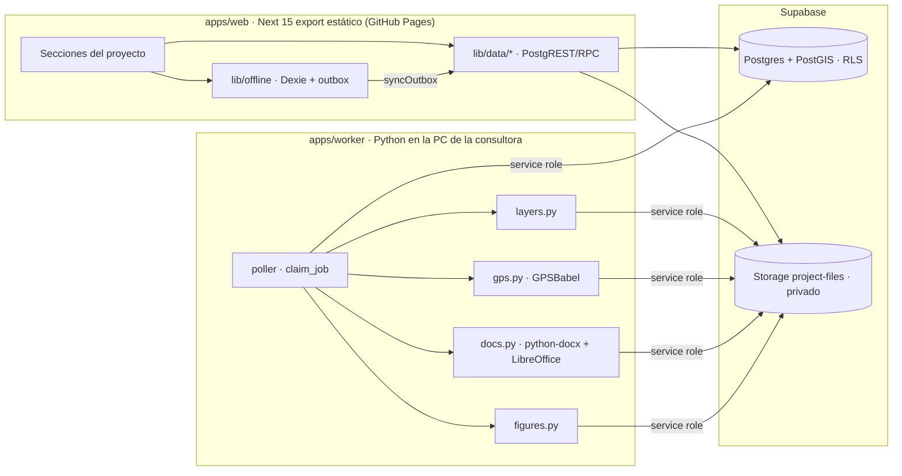

# Mapa del repo

Estado al 06/10/2026. Rutas relativas a la raíz. Para el qué y el porqué del producto: `CLAUDE.md`; lo abierto: `docs/PENDIENTES.md`.

## Flujo de punta a punta

| Paso | Web | Base / worker |
|---|---|---|
| Datos y alcance | `saveProject` `apps/web/src/lib/data/projects.ts:71`, `parseAlcance` `src/lib/alcance-parser.ts:66` → `addWorks` `src/lib/data/works.ts:61` | trigger `works_measures` `supabase/migrations/0002_ajustes.sql:9` |
| Capas SHP/KMZ | `groupLayerFiles` `src/lib/layer-files.ts:26` → `uploadLayer` `src/lib/data/layers.ts:49` | `run_layer_job` `apps/worker/app/jobs/poller.py` → `process_layer` `apps/worker/app/jobs/layers.py:219` |
| Relevamiento offline | `repo.ts:9,61,107` (fila + outbox en una transacción) → `syncOutbox` `src/lib/offline/sync.ts:32` → `remote.ts:13` | upsert idempotente por id del cliente |
| GPS .gdb | `uploadGps` `src/lib/data/gps.ts:57` | `run_gps_job` (poller) → `check_signature` `gps.py:39` (magic `MsRcf`) → `gdb_to_gpx` `gps.py:51` → `match_waypoints` `gps.py:83`; precedencia GPS `0007_gps_precedencia.sql:7` |
| Interferencias | `buildInterferencias` `src/lib/interferencias.ts:59` | `build_interferencias` `apps/worker/app/jobs/docs.py:84`; cruces `nearby_features` `0013_cruces_proximidad.sql:7` |
| Fotos | `compressPhoto` `src/lib/offline/photos.ts:4` (sin EXIF) | `prepare_photo` `docs.py:122` |
| Informe DOCX/PDF | `createBuild` `src/lib/data/builds.ts:50` | `run_docs_job` `docs.py:667` → `docx_to_pdf` `docs.py:473`; aprobar `approve_build` `0012_revision_visado.sql:32` |

## Puntos críticos

- **GK (X = norte, Y = este)**: `src/lib/geo/coords.ts:37` (`toPosgarFaja2`, test `coords.test.ts:13` con el punto de A.7), `apps/worker/app/core/geo.py:9`, vista `waypoints_view` `0001_init.sql:348` (`gk_x_norte = ST_Y`). Verificado en la base: X = 5.779.957,1 / Y = 2.537.775,1.
- **DMS**: `src/lib/geo/dms.ts:19` y `core/geo.py:15` (misma salida, "O" por oeste).
- **Umbral**: `src/lib/threshold.ts:17` (`pct` O `abs_m`); superficies pasan `abs_m: 0`.
- **Sync offline**: corta en el primer error y deja el resto en cola (`sync.ts:52`); última escritura gana salvo posición GPS.
- **Seguridad del worker**: usa service role. Toda ruta de Storage que viene de una fila se valida contra la org/proyecto: `_own_path` en `poller.py` (capas, GPS) y `docs.py:593` (informe); la base lo repite con `0019_rutas_propias.sql`.

## Base de datos

- Todas las tablas salvo `organizations` tienen `org_id` y RLS. Patrón `org_all` con `auth_org_ids()` (`0001_init.sql:22,434`); catálogos: lectura miembro, escritura admin (`0004_hardening_rls.sql:21`); `cadastre_data` solo admin (`0001:450`); `project_reviews` escribe admin (`0012:11`).
- Vistas con `security_invoker=true`: `waypoints_view`, `works_compare`, `layer_features_geojson`, `wells_geojson`.
- Storage `project-files` privado, ruta `{org}/{proj}/{tipo}/…`, lista blanca de extensiones y 200 MB en INSERT (`0002_ajustes.sql:111`).
- Estados de trabajos: solo el worker (`guard_job_status` `0002:307`); reclamo con `claim_job` (`FOR UPDATE SKIP LOCKED`).
- RPC: `add_member_by_email` `0002:79`, `create_document_build` `0008:24`, `approve_build`/`observe_build` `0012:32,61`, `duplicate_project` `0004:88`, `create_wells_from_import` `0005:37`, `project_center` `0014:4`.

## Tests

| Dónde | Qué | Cómo |
|---|---|---|
| `apps/web/src/**/*.test.ts` (21 archivos) | umbral, GK/DMS, checklist, interferencias, offline sync/repo/cache, schemas | `pnpm test` |
| `apps/web/e2e/flujo.spec.ts` | login, 360 px, relevamiento, matriz | `pnpm e2e` (pide `EIA_EMAIL`/`EIA_PASS`, base real) |
| `apps/worker/tests` | capas, GPS, informe, figuras, matriz, poller | `.venv\Scripts\python -m pytest` |
| `supabase/tests/*.sql` | RLS con 2 orgs, precedencia GPS, visado, cruces, rutas propias | SQL Editor como postgres; cada línea debe decir OK |

CI (`.github/workflows/deploy.yml`) corre solo lint, typecheck, test y build de la web.
